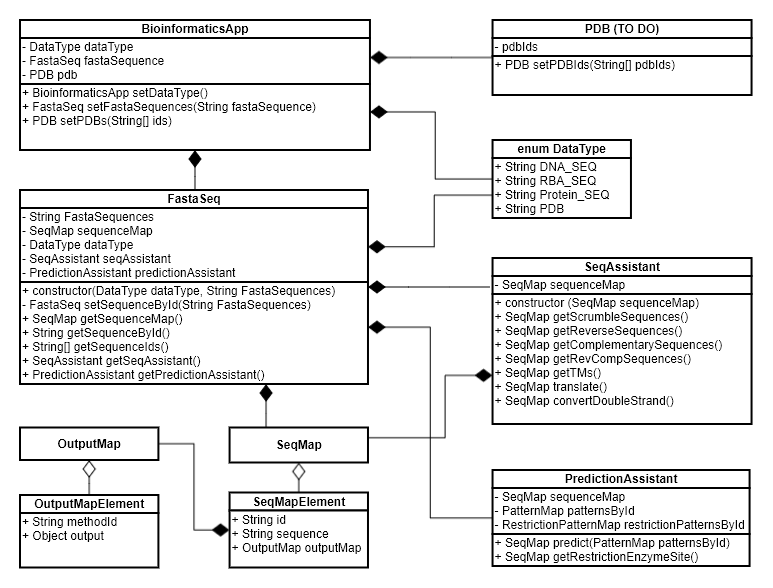

# Bioinformatics-Hub
Bioinformatics-Hub is an open source bioinformatics package for retrieving, processing and analyzing the sequences and structures of biomolecules, such as proteins, and nucleotides.
 
At current stage, this package can retrieve protein and nucleotide sequences from NCBI, analyze protein and nucleotide sequnces, and predict motifs in proteins and nucleotides. Sequences are primarily handled as a single string in [FASTA](https://blast.ncbi.nlm.nih.gov/Blast.cgi?CMD=Web&PAGE_TYPE=BlastDocs&DOC_TYPE=BlastHelp) format or as a javascript object. 

We will add protein structure retrieval and analysis modules in the future.

## Outline
- [Installation](#installation)
- [Handle user provieded sequences](#handle-user-provided-sequences)
  - [Setup bioinformaticsHub object](#setup-bioinformaticshub-object)
  - [Set/store sequences in BioinformaticsHub application](#step-2-store-user-provided-sequences-into-bioinformaticshub-object)
  - Get all sequence Ids
  - Get sequence by Id
  - Get all sequences with Ids as a key in to Javascript object
  - [Handle invalid input, blanks, numbers, unsupported charactors in user-provied sequences](#handle-comment-lines-numbers-gaps-blanks-and-comment-lines-in-user-provided-sequence-string)
- [Use NCBI Seqeuence Retriever (ncbiSeqRetriver) module](#use-ncbi-seqeuence-retriever-ncbiseqretriever-module)
  - [Retrieve protein sequences from NCBI](#fetch-protein-sequences-from-ncbi)
  - [Retrieve nucleotide sequences from NCBI](#fetch-nucleotide-sequences)
- [Predict/scan motifs in protein/nucleotides sequences](#predict-motifs-in-protein-or-nucleotide-sequences)
  - [Pattern syntax](#pattern-syntax)
  - [Predict motifs in user-provided sequences](#predict-motifs-in-protein-or-nucleotide-sequences-with-user-provided-sequences)
  - [Predict motifs in sequences with given NCBI ACCESSION Ids](#predict-motifs-in-protein-or-nucleotide-sequences-based-on-ncbi-accession-ids)
- Routine bioinformatics tools for protein/nucleotide sequences
  - TM (melting temperature) calculator (under development)
  - Reverse complement (under development)
  - Restriction sites detector (under development)
  - Scrumble sequence generator (under development)
  - Nucleotide to protein translator (under development)
- PDB module: retrieve and analyze protein structures (future task)
  - Retrieve protein structure from protein databank (future task)
  - Retrieve information from protein structure (future task)

## Installation
Running this package requires [nodeJS](https://nodejs.org/en/) environment. Run the below commend to install this package into your javascript project.
```
npm install --save bioinformatics-hub
```
## Handle user-provided sequences
### Setup bioinformaticsHub object
##### Step 1: Import "bioinformatics-hub" package and create a bioinformaticsHub object.
```
const BioinformaticsHub = require("bioinformatics-hub");
const bioInformaticsHub = new BioinformaticsHub();
```

##### Step 2: Store user-provided sequences into bioinformaticsHub object. 
This application can store one sequence or mutiple sequences provided by user. The sequences should be provided as a single string in [FASTA format](https://en.wikipedia.org/wiki/FASTA_format).
However, if user wants to store only one squence for analysis, then the squence id (started with ">" in FASTA format) is optional.
This application will automatically provide a sequence Id as "Unnamed sequence 1", if the only sequence does not have a sequence Id.

Here is an example on how to store two sequences in to this application.
```
>sequence_id_1
SLLKASSTLDNLFKELDKNGDGEVSYEEF
>sequence_id_2
DKDKD
```
These two sequences can be stored in this application as shown below.
```
const inputSequence = ">sequence_id_1\nSLLKASSTLDNLFKELDKNGDGEVSYEEF\n>sequence_id_2\r\nDKDKD";

bioInformaticsHub.setFastaSequences(inputSequence); 
```
Now, the bioinformaticsHub setup is completed, and user can use bioinformaticsHub to retrieve sequence Ids , sequences, or retrieve these sequences as a javascript object. User can also use bioinformaticsHub to perform sequence analysis, such as predicting motifs in these sequences.

User can retrieve all sequence Ids of the stored sequences using the code below:
```
const sequenceIdArray = bioInformaticsHub.getAllSequenceIds();
console.log(sequenceIdArray); 
// Console output: [ 'sequence_id_1', 'sequence_id_2' ]
```

User can retrieve a specifc sequence by a sequence Id using the code below:
```
const sequence1 = bioInformaticsHub.getSequenceById("sequence_id_1"); 
console.log(sequence1); 
// Console output: SLLKASSTLDNLFKELDKNGDGEVSYEEFF

const sequence2 = bioInformaticsHub.getSequenceById("sequence_id_2"); 
console.log(sequence2); 
// console output: DKDKD
```

User can retrive all sequences with Ids as a javascript object using the code below:
```
const sequencesWithIds = bioInformaticsHub.getAllSequencesWithIds(); 
console.log(sequencesWithIds); 
```
console output:
``` 
{ 
  sequence_id_1: 'SLLKASSTLDNLFKELDKNGDGEVSYEEF', 
  sequence_id_2: 'DKDKD' 
}
```
## Use NCBI Seqeuence Retriever (ncbiSeqRetriever) module
NCBI Seqeuence Retriever (ncbiRetriever module) is a light-weighted javascript module to fetch nucleotide or protein sequences from NCBI databases. This module is a simplified wrapper for [EFetch utility of NCBI E-utilities API](https://www.ncbi.nlm.nih.gov/books/NBK25499/#chapter4.EFetch). 

NCBI Seqeuence Retriever module can fetch upto **100** protein sequences or upto **10 short** nuclotide sequences in one sequence retrieve call. We strongly recommend that the lenght of each nucleotide sequence for query should be less than *100,000* bp.

The retrieved sequences can be returned as a string in FASTA format, or be returned as a javascipt object.

NCBI Seqeuence Retriever is also a stand alone npm package, named ["ncbi-sequence-retriever"](https://www.npmjs.com/package/ncbi-sequence-retriever).

### Fetch **protein** sequences from NCBI
Here are examples to fetch mulitple protein sequences from [NCBI protein databse](https://www.ncbi.nlm.nih.gov/protein/) with user-provided ACCESSION Ids.

#### Return a string representive of sequences in FASTA format 
```
const {ncbiSequenceRetriver} = require ("bioinformatics-hub/modules");

const proteinIds = ["AAA49004.1","AAK64208.1"];  // add upto 100 accession Ids in this array
ncbiSequenceRetriver.retrieveProteinSequences(proteinIds).then((sequences)=>{
  console.log(sequences);
});
```
The output from above code: 
```
>AAA49004.1 parvalbumin, partial [Gallus gallus]
FIEEDELKFVLKGFTPDGRDLSDKETKALLAAGDKDGDGKIGVEK

>AAK64208.1 calbindin D9k [Mus musculus]
MCAEKSPAEMKSIFQKYAAKEGDPDQLSKEELKLLIQSEFPSLLKASSTLDNLFKELDKNGDGEVSYEEF
EAFFKKLSQ
```
#### Return sequences as a javascript object
```
const {ncbiSequenceRetriver} = require ("bioinformatics-hub/modules");

const proteinIds = ["AAA49004.1","AAK64208.1"];  // add upto 100 accession Ids in this array
ncbiSequenceRetriver.retrieveProteinSequences(proteinIds, "JSON").then((sequences)=>{
  console.log(sequences);
});
```
The output from above code: 
```
{ 'AAA49004.1 parvalbumin, partial [Gallus gallus]': 
    'FIEEDELKFVLKGFTPDGRDLSDKETKALLAAGDKDGDGKIGVEK',
  'AAK64208.1 calbindin D9k [Mus musculus]':
    'MCAEKSPAEMKSIFQKYAAKEGDPDQLSKEELKLLIQSEFPSLLKASSTLDNLFKELDKNGDGEVSYEEFEAFFKKLSQ' 
}
```

### Fetch **nucleotide** sequences
Here are examples to fetch one mRNA sequence from [NCBI nucleotide databse](https://www.ncbi.nlm.nih.gov/nuccore/) with user-provided ACCESSION Ids:

#### Return a string representive of sequences in FASTA format 
```
const {ncbiSequenceRetriver} = require ("bioinformatics-hub/modules");

const nucleotidesIds = ["M65068.1"];  // add upto 10 accession Ids in this array
ncbiSequenceRetriver.retrieveNucleotideSequences(nucleotidesIds).then((sequences)=>{
  console.log(sequences);
});
```
The output from above code: 
```
>M65068.1 Chicken parvalbumin mRNA, partial cds
TTTATTGAGGAGGATGAGCTAAAGTTTGTACTGAAGGGCTTTACCCCAGATGGCAGAGACCTATCAGACA
AAGAGACAAAGGCTCTTCTGGCTGCTGGAGATAAGGACGGTGATGGCAAAATCGGCGTGGAAAAA
```
#### Return sequences as a javascript object
```
const {ncbiSequenceRetriver} = require ("bioinformatics-hub/modules");

const nucleotidesIds = ["M65068.1"];  // add upto 10 accession Ids in this array
ncbiSequenceRetriver.retrieveNucleotideSequences(nucleotidesIds, "JSON").then((sequences)=>{
  console.log(sequences);
});
```
The output from above code: 
```
{
  'M65068.1 Chicken parvalbumin mRNA, partial cds': 
    'TTTATTGAGGAGGATGAGCTAAAGTTTGTACTGAAGGGCTTTACCCCAGATGGCAGAGACCTATCAGACAAAGAGACAAAGGCTCTTCTGGCTGCTGGAGATAAGGACGGTGATGGCAAAATCGGCGTGGAAAAA' 
}
```
### Optional API key
`retrieveNucleotideSequences()` and `retrieveProteinSequences()` methods in `ncbiSequenceRetriver` can take a string API key as the third input parameter. This is *optional*. This parameter is set to be undefined by default. Adding an valid API key as the third input parameter to these methods can increase the number of sequence retrieve calls from 3 calls per second to 10 calls per second from one Ip address.

*On December 1, 2018, NCBI will begin enforcing the use of API keys that will offer enhanced levels of supported access to the E-utilities. After that date, any site (IP address) posting more than 3 requests per second to the E-utilities without an API key will receive an error message. By including an API key, a site can post up to 10 requests per second by default.* More rules about API key can be found in this link: https://www.ncbi.nlm.nih.gov/books/NBK25497/#chapter2.Coming_in_December_2018_API_Key

Sample code with API key as the third input arguement:
```
const {ncbiSequenceRetriver} = require ("bioinformatics-hub/modules");

const nucleotidesIds = ["M65068.1"];  
const apiKey = "fake_api_key";  // if you have a valid API key, set up in this line.
ncbiSequenceRetriver.retrieveNucleotideSequences(nucleotidesIds, "JSON", apiKey).then((sequences)=>{
  console.log(sequences);
});
```

## Predict motifs in protein or nucleotide sequences with user-provided sequences
This application can predict motifs in one or mutiple sequences using user defined pattern. User should define one or multiple patterns based on the pattern [syntax rules](#pattern-syntax). 

### Pattern syntax
- The standard IUPAC one letter code for the amino acids (for example: "P" stands Proline) and nucleotides code (for example: "C" stands for "cytosine") should be used to define a patten.
- "[]" with listed aminoacids or nucleotides letters means that the listed letters are allowed in this position. Charactor "," in between letters are **optional**. For example: [A,T,C] or [ATC] stands for "A" or "T" or "C" are allowed in this position. 
- "{}" with listed amino acids or nucleotides letters means that the listed letters are NOT allowed in this position. Charactor "," in between letters are **optional**. For example: {DE} or {D,E} means "D" or "E" should not be allowed in this position.
- The wildcard "x" means that any amino acid or nucleotide in this position is accepted.
- Each element in a pattern could be separated from its neighbor by a '-'. This is **optional**. For example, [A,T]-x-{C,A}, [A,T]x{C,A}, [AT]-x-{CA}, and [AT]x{CA} are identical patterns. 
- Repetition of an element in multiple continuous positions can be represented by following that element with a "(number of repeats)" or a "(minimum repeates, maximium repeates)".
  - Examples:
  - A(3) stands for AAA
  - T(2,5) stands TT, TTT, TTTT, or TTTTT.
- User should add a "^" or "<" to indicate that the pattern must started with N-terminal (or 5' terminal).
- User should add a "$" or ">" to indicate that the pattern must ended with C-terminal (or 3' terminal).

### Predict a single motif in a single sequence
The sample sequence for prediction: 
```
>seq1
SLLKASSTLDNLFKELDKNGDGEVSYEEF
```

The sample pattern for prediction:
```
[D]-x-[DNS]-{FLIVWY}-[DNESTG]
```

### General workflow for prediction: 
1. import "bioinformatics-hub" package.
2. create bioinformaticsHub object.
3. store sequences in the bioinformaticsHub object.
4. retrieve PredictionAssistant object.
5. set one or mutiple patterns.
6. call predict() method and the prediction results will be returned.

The example shown below demostrates the prediction workflow for predicting one user-defined motif (named "patternId_1") in one protein sequence (named "seq1").
```
const BioinformaticsHub = require("bioinformatics-hub");

const bioInformaticsHub = new BioinformaticsHub();
bioInformaticsHub.setFastaSequences(">seq1\nSLLKASSTLDNLFKELDKNGDGEVSYEEF"); // store sequences here
                 .getPredictionAssistant()
                 .setPatterns({"patternId_1": "[D]-x-[DNS]-{FLIVWY}-[DNESTG]"}) // store pattern here
                 .predict();
```
Execution of above code will find all matches of the given pattern(patternId_1) in the given sequence(seq1). The expected output is shown below:
```
[
  { 
    sequenceId: 'seq1',
    sequence: 'SLLKASSTLDNLFKELDKNGDGEVSYEEF', 
    contained_motifs: [ 'patternId_1' ],    // Indicate which motifs are found in "seq1"
    motifs:
      { 
        patternId_1:     // the prediction result on "patternId_1"
          {
            pattern_signiture: '[D]-x-[DNS]-{FLIVWY}-[DNESTG]', 
            matched_sequences: 
              [ 
                { 
                  startIndex: 16, 
                  matched_sequence: 'DKNGD' 
                }
              ]
          }
      } 
  } 
]
```
### Predict motifs in protein or nucleotide sequences based on NCBI ACCESSION ids
The ncbiMotifScanner module in BioinformaticsHub can predict/scan motifs on sequences if user provides the NCBI ACCESSION ids and patterns.
#### Scan/predict protein sequnces based on NCBI accession ids
```
const {ncbiMotifScanner} = require("bioinformatics-hub/modules");

const sequenceIdArray = ["CAA44792.1", "EEB16923.1"];
const patterns = {
  "EF-Hand": "[DNS]x[DNS]{FLIVWY}[DNESTG][DNQGHRK]{GP}[LIVMC][DENQSTAGC]x(2)[ED]",
  "zinc finger": "[C]x(2,5)[C]x(12,13)[H]x(2,5)[H]"
};

ncbiMotifScanner.scanProteinMotifsWithNcbiIds(sequenceIdArray, patterns).then((value) =>{
  // print the whole output object
  console.log(value);
});
```

#### Scan/predict nucloetide sequnces based on NCBI accession ids
```
const {ncbiMotifScanner} = require("bioinformatics-hub/modules");

const sequenceIdArray = ["NM_009788.4"];
const patterns = {
  "pattern_1": "[A,T]x[C,G]x{A}[G]x(2,5)[C,G]"
};

ncbiMotifScanner.scanNucleotideMotifsWithNcbiIds(sequenceIdArray, patterns).then((value) =>{
  // print the whole output object
  console.log(value);
});
```
#### Optional API key
`ncbiMotifScanner.scanProteinMotifsWithNcbiIds()` and `ncbiMotifScanner.scanNucleotideMotifsWithNcbiIds()` methods can take the third input paramater, apiKey. You can read more about API key in [NCBI Seqeuence Retriever](#optional-api-key) session.

## Handle comment lines, numbers, gaps, blanks, and comment lines in user-provided sequence string.
This application has build in functions to validate and clean up the input sequences. We handle each situation differently when `bioInformaticsHub.setFastaSequences(string);` method is called.
- Invalid input
  - The input string cannot be blank, empty, null or undefined.
  - Two sequences should not the identical sequence Id.
  - Sequence Ids can contain any charactors. Sequences should only contain letters a-z, A-Z, "-" (optional, stands for gap) and * (optional, stands for termination). 
  - It is invalid if a sequence has a sequence id but sequence is blank. In the example shown below, sequence 1 is not valid as the sequence is blank.
  ```
  >sequence 1

  >sequence 2
  AAAATTTAAAATTT
  ```

- Single sequence without a sequence Id

  A single sequence without a sequence Id is a valid input sequence. This application will automatically add "Unamed sequence 1" as its sequence Id.

- The first sequence in multiple sequences do not have a sequence Id

  If the first sequence in multiple sequences do not have a sequence Id, this application will automatically add "Unnamed sequence 1" as its sequence Id.

- Numbers in sequences

  Numbers in sequences will be removed automatically.

- Blanks in sequences

  Blanks, such as \r\n,  in sequences will be removed automatically. Blank lines inside of a sequence will be removded as well.

- Comment lines

  Comment lines (started with ";") in a FASTA sequence will be removed automatically.

Based on above rules, "Sample sequence 3" and "Sample sequence 4" shown below will have the identical sequences when saved in BioinformaticsHub application.
```
>Sample sequence 3
; this is a comment line, will be removed by CommentLineRemover;
; Numbers and blanks in below sequence will also be removed 
AAACTCCTCTTTGATTCTTCTAG CTGTTTCACTATTGGGCAACCAGACACCAGAATGAGTACTAAAAAGT 12023423

CTCCTGAGGAACTGAAGAGGATTTTTG 55AAAAATATGCAGCCAAAGAAGGTGATCCAGACCAGTTGTCAAA

>Sample sequence 4
AAACTCCTCTTTGATTCTTCTAGCTGTTTCACTATTGGGCAACCAGACACCAGAATGAGTACTAAAAAGT
CTCCTGAGGAACTGAAGAGGATTTTTGAAAAATATGCAGCCAAAGAAGGTGATCCAGACCAGTTGTCAAA
```

## Version changes
- 1.3.4
  - Fix a bug related with making request using http instead of https by update ncbi-sequence-retriever version.
- 1.3.3
  - Fix a bug related with an error when using react by updating ncbi-sequence-retriever version.
- 1.3.2
  - Fix a bug related with an error when using react.
- 1.3.1
  - bug fix.
- 1.3.0
  - Given an array of ACCESSION ids from NCBI protein or nucleotide databases, ncbiMotifScanner module can predict/sca motifs in these sequences.
- 1.2.0
  - Retrieve nucleotide or protein sequences in bacth by ACCESSION Ids from NCBI.
- 1.1.2
  - Update README.MD
- 1.1.1
  - Update README.MD
- 1.1.0
  - Read multiple protein or nucleotide sequences.
  - Remove any numbers, blanks, and comment line (line start with ";") in each sequence.
  - Retrieve a specific sequence by squenceId.
  - Retrieve all sequence Ids.
  - Retrieve all sequences as javascript object indexed by sequence Ids.
  - Scan and predict protein/nucleotide motifs in multiple sequences provided by user in [FASTA](https://blast.ncbi.nlm.nih.gov/Blast.cgi?CMD=Web&PAGE_TYPE=BlastDocs&DOC_TYPE=BlastHelp) format.

## For internal Bioinformatics-Hub developers
### High Level Design

### Test
 [Jest](https://jestjs.io/docs/en/getting-started) is used to perfom all unit tests in this repository. Tests are written in the [test](./test) folder using the idential file structure in the .js files in the src folder. 
Use this command to run all the unit tests:
```
npm run test
``` 

**Note: Each commit in master branch must sure to have 0 test failure.**

### ESLint
We use [ESLint](https://eslint.org/docs/user-guide/getting-started) to enforce js format. ESLint rules is defined in [.eslintrc.json](./.eslintrc.json) file. 
Run this command to check js format issues: 
```
npm run lint
```
Run this command to check js format and auto-fix issues:
```
npm run lint-fix
```

